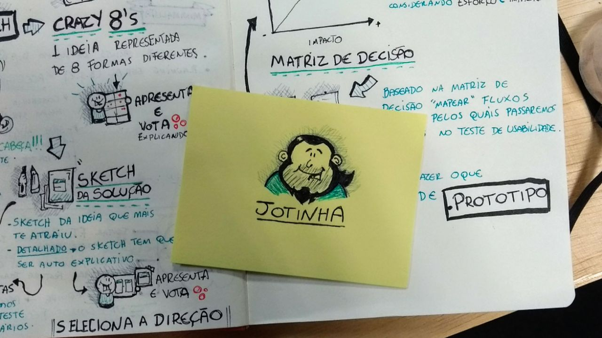

# VivaReal / Grupo ZAP: freedom, ownership and scale

I joined VivaReal on Friday, October 14, 2016. It became one of the most important workplaces of my
career—not only because of what I built there, but because it clarified the kind of culture in which I
do my best work.

I had recently spent a period living in Petrópolis and commuting for more than four hours each day to
central Rio de Janeiro. Rigid schedules and the weight of that routine had drained much of my energy.
VivaReal brought me back to an environment built on flexibility, trust, ownership and accountability.
The difference was immediate: autonomy made me more invested in the work and more willing to take
responsibility for outcomes.

The company changed names around me. I joined VivaReal, remained through its merger with ZAP Imóveis
and helped build the unified Grupo ZAP platform. OLX announced its acquisition of Grupo ZAP during my
final months there and completed it after I had left. That lineage is why this period now appears in my
career as OLX Brasil / Grupo ZAP / VivaReal, even though the experience I lived directly was centered
on VivaReal and Grupo ZAP.

## Learning beyond a single stack

VivaReal was also the most technologically diverse environment I had encountered. It was my first
professional experience with AWS, Kafka and Protocol Buffers, and the first time I worked inside an
organization where many programming languages coexisted naturally.

I delivered production work across JavaScript, Node.js, Java, Kotlin, Python and Go, while learning
from an engineering ecosystem that also included Ruby and Scala. That exposure changed how I saw my
own role. A language was no longer the center of my professional identity; what mattered was
understanding the system, choosing an appropriate tool, sharing knowledge and taking responsibility
for the result.

## GeoSearch, portal performance and experimentation

My first phase was close to the VivaReal portal. I built a GeoSearch experiment that added maps to
property listings using Java, Spring, Hibernate, JUnit, Gradle and legacy jQuery. I also worked on a
responsive, mobile-first listings landing page with Handlebars, Backbone and Marionette.js, supported
by Selenium and Jenkins end-to-end tests.

Performance was a product concern rather than an isolated technical metric. I helped reduce peak time
to first byte from approximately four seconds to below 500 milliseconds and add frontend measurements
such as time to first byte and first meaningful paint with SpeedCurve.

Hack Week turned experimentation into a focused ritual. We had about a month to propose ideas and form
groups across Product and Engineering, followed by one intense week to build, test and present working
prototypes. The strongest proposals could continue into production.

I contributed to two Hack Week initiatives that reached production. For the condominium pages, which
helped people find and compare properties inside a specific condominium, I built most of the backend
and a smaller part of the frontend. For the points-of-interest experience, I worked only on the
frontend, using the Google Maps API to place nearby locations on the map. It was one of my first deeper
experiences with geographic and location-based product challenges. Both initiatives were team efforts
and gave me room to contribute beyond my usual role.

The freedom to organize around an idea, work across roles and turn a prototype into a real product was
exactly the kind of ownership that energized me at VivaReal.

*Hack Week at VivaReal, July 2017: ideation, decision mapping and prototyping, with a hand-drawn
“Jotinha” left on my workspace.*

## Listings at the center of the platform

After the merger, I joined the Listings squad. A listing—the advertisement for a property—was the
central entity connecting search, recommendations, SEO, images, partner feeds, leads and both consumer
portals. Working in that domain meant working near the core of the company.

The integration required VivaReal and ZAP Imóveis to converge on a shared representation while their
existing systems continued operating. I helped define a Protocol Buffers listings model used across
more than 50 APIs in different languages. I also developed three Kafka producers and consumers in
Python 3 to move and synchronize listings between the two ecosystems using PostgreSQL on RDS.

At the same time, I worked on the reliability and efficiency of critical listings endpoints. I
established a 99% service-level objective below 200 milliseconds and reduced Kubernetes pod cost by
20% through targeted refactoring. Those changes taught me to treat latency, capacity and cloud cost as
parts of the product contract.

## Crossing boundaries and leading teams

The culture made team boundaries permeable when the work required it. In Canal Pro, I helped build the
new platform through which customers managed their business with the company. I worked across Vue.js,
Vuex and JavaScript on the frontend and Java, Node.js and GraphQL on the backend. We used A/B tests to
migrate customers gradually from a legacy application and I contributed outside my immediate context
when another domain held data the product needed.

I later became technical lead for Inc Pro, a new platform for property developers. I led 10 engineers,
including four working remotely, and designed domain APIs and the main Node.js and GraphQL orchestrator
with product managers. My implementation work included authentication, permissions and organizational
hierarchies, Go workers and ETLs, Node.js APIs, Python workers and event flows through SQS and Avro
data-lake channels.

Technical leadership also meant making knowledge circulate. I facilitated dojos on GraphQL, clean
code and Node.js and tried to create the same conditions from which I had benefited: room to ask,
experiment, disagree and learn from other people's strengths.

## The culture where I did my best work

Autonomy at VivaReal and Grupo ZAP was operational, not aspirational. Public communication channels,
open delivery reviews and Town Halls gave people access to context and permission to question
decisions. Engineers could identify a need, organize across squads and propose a solution without
waiting for a chain of commands. Mistakes were opportunities to react and learn, not occasions to look
for someone to blame.

That combination of freedom, transparency and responsibility energized me. It helped me move across
languages and domains, contribute beyond the boundaries of a ticket and eventually lead other
engineers. More importantly, it gave me a durable way to evaluate a workplace: I do my best work where
people are trusted with both the freedom to act and the responsibility to understand the whole.

## Writing from this period

- [“Trabalhando com super-heróis”](https://medium.com/tech-grupozap/trabalhando-com-super-herois-a5c91b51343d),
  on learning from colleagues' individual strengths and the culture I found at VivaReal.
- [“Participando da Hackweek 2017”](https://medium.com/tech-grupozap/participando-da-hackweek-2017-f8dbd18010d2),
  my contemporary account of the preparation, cross-team collaboration and path from prototype to
  production.
